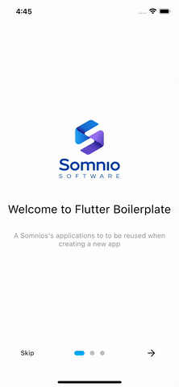
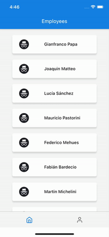
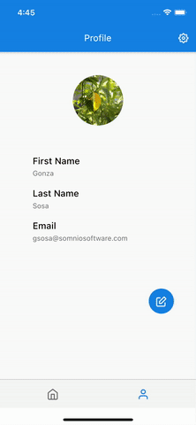

# Flutter Firebase Starter

[][somnio_software_link]

Developed with :blue_heart: &nbsp;by [Somnio Software][somnio_software_link]

[![License: MIT][license_badge]][license_link]

---

### Firebase features out-of-the-box :package:

✅&nbsp; Crashlytics

✅&nbsp; Analytics

✅&nbsp; Cloud messaging

✅&nbsp; Authentication

✅&nbsp; Firestore

✅&nbsp; Storage

✅&nbsp; Remote config

---

### Supported sign-in methods

✅&nbsp; Anonymous

✅&nbsp; Email & Password

✅&nbsp; Facebook

✅&nbsp; Google

✅&nbsp; Apple

---

## Gallery 

&nbsp;&nbsp;&nbsp;&nbsp;&nbsp;&nbsp;
---

### Project Structure

```bash
├── bloc
├── constants
├── mixins
├── models
├── repository
├── screens
├── services
├── utils
├── widgets
├── app.dart
├── main.dart
└── README.md
```

- bloc: where we handle the current state of the app. The UI layer communicates with components of the bloc layer by dispatching events and listening to changes in the state.
- constants: here we have files related to strings, font weights, and assets.
- mixins: helper classes that we use to abstract some common behavior and reuse it across different places like inside the bloc layer.
- models: here you can find your domain which represents abstractions of the real world.
- repository: the repository layer provides a more object-oriented view of the persistence layer.
- screens: all the screens of the app go here, it is the UI layer.
- services: here you can find abstractions of all the third-party services that we use across the app, like persistence, notifications, etc.
- utils: helper functions that we use across the app.
- widgets: in the widget folder lives purely UI components. We have reusable components as well as widgets that are coupled to a particular screen.
- app: responsible to inflate widgets, initiate process among other stuff.
- main: entry point of the app.

---

### Getting Started :muscle:

Some configuration steps are required to use this project with Firebase, such as:
- Creating a new project with the Firebase console.
- Adding iOS and Android apps in the Firebase project settings.
See this [document][firebase_setup] for the complete instructions.

Crashlytics:
- To test the crash reporting, the app can be forced to crash using the following line:
  `FirebaseCrashlytics.instance.crash();`
  the Above line can be put anywhere we want the crash to happen.
- Crash reporting happens only when the app has restarted after a crash.
- Go to Crashlytics in the Firebase project.Wait for some time as it can take a few minutes for crashes to appear.
- [Flutter package][crashlytics_package]
- [Learn more][crashlytics_learn_more]

Analytics:
- To log an event use the [get_it][get_it_package] service locator instance and get `AnalyticsService`. The `AnalyticsService` is an abstract class that can be extended to add another analytics service.
- After configuring Firebase Analytics correctly, it can take some minutes or some hours to show up the events in the Analytics Dashboard of Firebase Console. To track the events nearly in real-time, [debug view][analytics_debug_view] can be used.
- [Flutter package][analytics_package]
- [Learn more][analytics_learn_more]

Cloud messaging

- You can use push notifications and local notifications depending on the 3 possible states your app would be.
```dart
FirebaseMessaging.onMessage.listen((event) async {
  await _localNotificationService.showNotification();
});
FirebaseMessaging.onMessageOpenedApp.listen(
  (event) => _onNotificationChanged(event.data),
);
FirebaseMessaging.onBackgroundMessage(
  (message) => _onNotificationChanged(message.data),
);
```

- [Flutter package][messaging_package]
- [Learn more][messaging_learn_more]

Authentication:

- [Google Sign-In][google_sign_in_ios] on iOS
- [Google Sign-In][google_sign_in_android] on Android
- [Facebook Login][facebook_login_ios] on iOS
- [Facebook Login][facebook_login_android] on Android
- [Apple Sign-in][apple_sign_in]

Firestore

- Generic implementation of Firestore methods: get, post, put, delete.
- The repository class interacts with the Firestore persistence service.
- [Flutter package][firestore_package]
- [Learn more][firestore_learn_more]

Storage

- Methods for uploading and downloading a file from Firebase storage.
```dart
  Future<void> uploadFile(File file, String storagePath);
  Future<String> downloadFile(String storagePath, String localPath);
  Future<String> downloadURL(String storagePath);
```

- [Flutter package][storage_package]
- [Learn more][storage_learn_more]

Remote Config

- Example on how to use Remote Config to communicate to users if the version of an app has increased.
- [Flutter package][remote_config_package]
- [Learn more][remote_config_learn_more]

---

### Other cool features :fire:

✅&nbsp; Internationalization

The configuration is on the yaml file on the root directory.

```yaml
arb-dir: lib/constants/l10n
template-arb-file: app_en.arb
output-localization-file: app_localizations.dart
```

You can add new languages each one should have its own file. E.g:

```yaml
{
  “helloWorld”: “Hello World!“,
  “@helloWorld”: { “description”: “Somnio Software loves Flutter” },
}
```

✅&nbsp; [Shared Preferences][shared_preferences_package]
A providing persistent storage for simple data.
✅&nbsp; [Image Picker][image_picker_package]
You can take pick images from the library or take photos to update you user profile picture.
✅&nbsp; [Onboarding][onboarding_package]
 Basic example of an onboarding flow where you can give users a little explanation about the app.
✅&nbsp; [Splash Screen][splash_screen_package]
You can easily configure and cusotmize the splash screen in the pubspec.yaml.
```yaml
flutter_native_splash:
  color: “#42A5F5"
  image: assets/somnio_logo.png
  color_dark: “#042A49”
  image_dark: assets/somnio_logo.png
  web: false
```
✅&nbsp; Flavors
We have defined 3 different flavors or development environments:
- Development
- Staging
- Production
Each of these flavors will use a different Firebase project. You can add `google-services.json`(Android) and `GoogleService-info.plist`(iOS) for each flavor in following locations:
  - Android:
    - `android/app/src/dev`
    - `android/app/src/staging`
    - `android/app/src/prod`
  - iOS:
    - `ios/config/dev`
    - `ios/config/staging`
    - `ios/config/prod`
  - Note: For iOS, XCode might not be able to find the files from the above locations if you simply copy them there. You need to drag and drop or use the Add Files option by right-clicking the folder to make sure that they are added to the Runner target.
- You can use each flavor as follows:
  - You can run this command in Terminal: `flutter run --flavor FLAVOR_NAME` where FLAVOR_NAME can be replaced with either one of `dev`, `staging`, or `prod`.
  - We have also provided the launch configuration for VSCode which you can view from the menu: `Run > Open Configurations`
  - You can easily switch between different configuratons from the Status bar in VSCode.
- You can get a current flavor in Flutter by using `getCurrentFlavor()` method from the `AppInfo` class.
- More on [flavors][flavors]

---

### Coming Soon :rocket:

This project is under construction. Contributions, issues and suggestions are very welcome! 
Moreover, we want to incorporate these new features:

- [ ] Support more sign-in methods like GitHub, Twitter.
- [ ] Phone Verification
- [ ] Dynamic Links
- [ ] Real-time database
- [ ] Performance
- [ ] Error Management
- [ ] Unit, Widget & Integration testing.
- [ ] Continuous integration & Continuous Deployment with Firebase App Distribution.

[//]: # "Flutter Firebase Starter links."
[somnio_software_link]: https://somniosoftware.com/
[license_badge]: https://img.shields.io/badge/license-MIT-blue.svg
[license_link]: https://opensource.org/licenses/MIT
[//]: # "Getting Started links."
[firebase_setup]: https://firebase.google.com/docs/flutter/setup
[crashlytics_package]: https://pub.dev/packages/firebase_crashlytics
[crashlytics_learn_more]: https://firebase.flutter.dev/docs/crashlytics/overview/
[analytics_package]: https://pub.dev/packages/firebase_analytics
[analytics_learn_more]: https://firebase.flutter.dev/docs/analytics/overview
[analytics_debug_view]: https://firebase.google.com/docs/analytics/debugview
[get_it_package]: https://pub.dev/packages/get_it
[messaging_package]: https://pub.dev/packages/firebase_messaging
[messaging_learn_more]: https://firebase.flutter.dev/docs/messaging/overview
[google_sign_in_ios]: https://firebase.google.com/docs/auth/ios/google-signin
[google_sign_in_android]: https://firebase.google.com/docs/auth/android/google-signin
[facebook_login_ios]: https://developers.facebook.com/docs/facebook-login/ios
[facebook_login_android]: https://developers.facebook.com/docs/facebook-login/android
[apple_sign_in]: https://pub.dev/packages/sign_in_with_apple
[firestore_package]: https://pub.dev/packages/cloud_firestore
[firestore_learn_more]: https://firebase.flutter.dev/docs/firestore/overview
[storage_package]: https://pub.dev/packages/firebase_storage
[storage_learn_more]: https://firebase.flutter.dev/docs/storage/overview
[dynamic_links_package]: https://pub.dev/packages/firebase_dynamic_links
[remote_config_package]: https://pub.dev/packages/firebase_remote_config
[remote_config_learn_more]: https://firebase.flutter.dev/docs/remote-config/overview
[//]: # "Other Cool features links."
[shared_preferences_package]: https://pub.dev/packages/shared_preferences
[image_picker_package]: https://pub.dev/packages/image_picker
[onboarding_package]: https://pub.dev/packages/introduction_screen
[splash_screen_package]: https://pub.dev/packages/flutter_native_splash
[flavors]: https://flutter.dev/docs/deployment/flavors